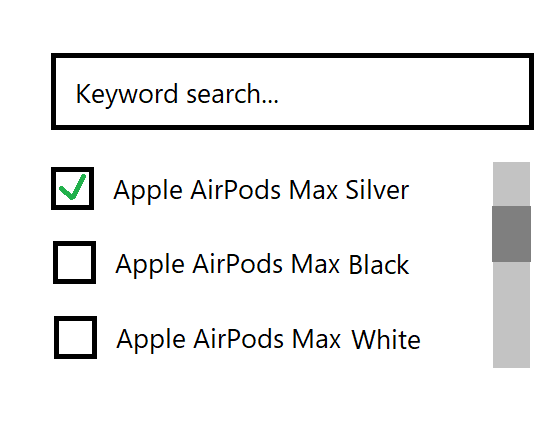

# Test task, utilizing

## Task Description

Create a ReactJS component according to the diagram.
When the user types in the text input field the items in the list should be updated with a fetch query filtered by the keywords: https://dummyjson.com/docs/products#products-search
Implement debounce to optimize the request rate when typing.
Implement infinite scroll pagination.
Store the selected items in the component state.

## Instructions to build and run

```
npm install
npm run build
npm run preview

```


"# dummyjson-test"
